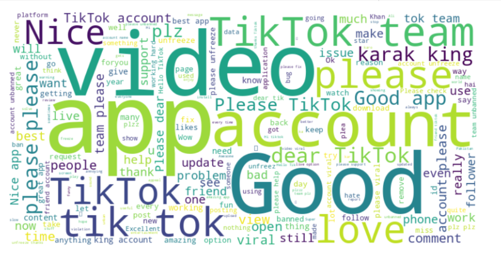
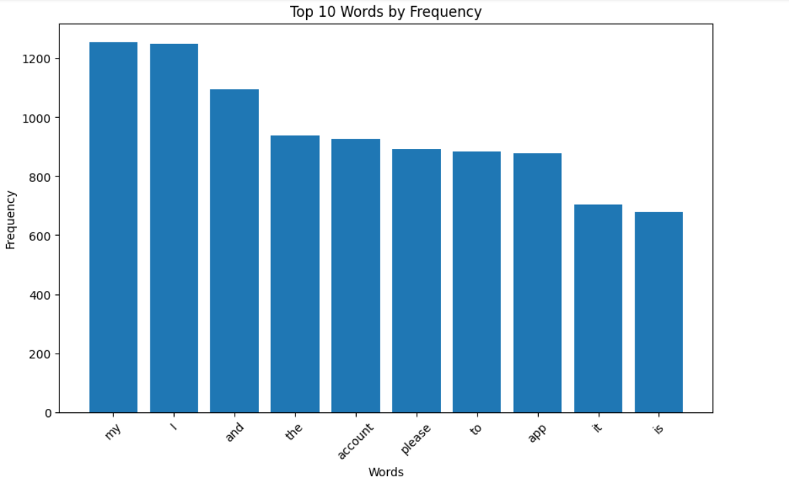
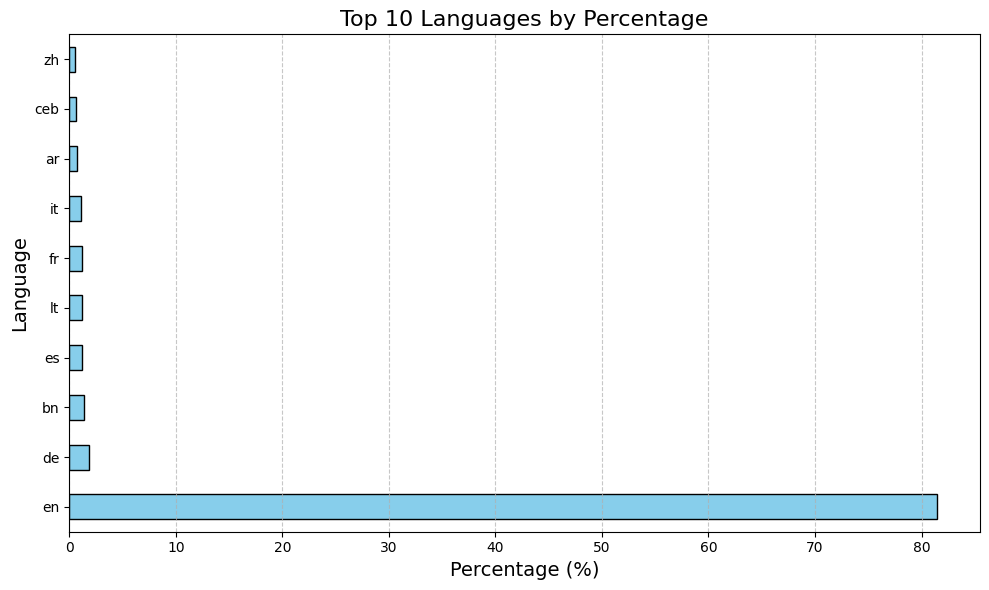

# **TikTok Reviews: Data Collection, Processing, and Analysis**

## **Project Overview**
This project explores user reviews for the TikTok app collected from the Google Play Store. The goal is to clean, analyze, and process the reviews to prepare them for further analysis, such as sentiment analysis, feature extraction, and trend identification. The reviews were filtered, cleaned, and processed using several techniques to ensure consistency and reliability of the dataset.

---

## **Features**

### **Data Collection**
- Collected 5,000 TikTok reviews from the Google Play Store.
- Stored reviews in a CSV file for processing.

### **Data Profiling and Cleaning**
- Removed duplicates and missing values.
- Standardized text to lowercase and removed URLs, punctuation, and stopwords.

### **Language Detection and Translation**
- Detected the language of each review using fastText.
- Filtered out rare languages with less than 0.6% representation.
- Translated non-English reviews to English for consistency.

### **Spelling and Text Normalization**
- Corrected typos while preserving critical terms like "TikTok" and "app."
- Applied lemmatization to reduce words to their base forms.

### **Data Output**
- Saved the final cleaned and processed data in CSV format, including lemmatized reviews, ratings, and timestamps.

---

## **Project Workflow**

### **1. Data Profiling**
- **Duplicates Removed:** Identified and removed duplicate entries in the dataset.
- **Missing Values:**  Identified missing reviews to ensure data consistency.
- **Word Frequencies:** Computed the most 10 frequent words in the dataset.
- **Checking the Spelling Mistakes:** Spelling mistakes in the reviews were systematically identified using the **TextBlob** library. This process involved analyzing each word in the text to detect errors and correct them. Detecting and correcting spelling mistakes is critical to improving the quality of the dataset,
as errors can introduce noise and reduce the effectiveness of downstream tasks like sentiment analysis or keyword extraction.
- **Visualize the textual content using two different charts.**

#### **Figure 1: Word Cloud of Most Frequent Words**
The word cloud below represents the most common words found in the reviews. Larger words indicate higher frequency.

#### **Figure 2: Top 10 Words by Frequency**
The bar chart below shows the 10 most frequent words in the dataset after cleaning.

---

### **2. Language Detection and Translation**
- **Languages Detected:** Reviews were written in 11 languages, with English comprising 87.7%.
- **Languages Filtered:** Rare languages (those with less than 0.6% representation) were removed.
- **Translation:** Approximately 50% of non-English reviews were successfully translated into English.

#### **Figure 3: Language Distribution**
The bar chart below shows the distribution of the top 10 detected languages by percentage.

---

### **3. Data Cleaning**
- **Stopwords and Punctuation Removal:** Cleaned text by removing unnecessary elements like punctuation, URLs, and stopwords.
- **Lowercasing:** Converted all text to lowercase for consistency.
- **Spelling Correction:** Typos were corrected while preserving critical terms like "TikTok" and "app."

---

### **4. Text Normalization**
- **Lemmatization:** Applied lemmatization to reduce words to their base forms, ensuring consistency across similar words.

---

### **5. Processed Dataset**
- **Final Dataset:** Retained approximately 91% of the original data after cleaning and filtering.
- **Saved as CSV:** Processed reviews were saved in CSV format, including the following fields:
  - **Text:** Lemmatized and cleaned review content.
  - **Rating:** Numerical rating given by users.
  - **Timestamp:** Date and time when the review was submitted.

---

## **Insights and Figures**

### **Key Insights**
- The dataset was dominated by English reviews (87.7%).
- Common themes in the reviews included app usability, updates, and performance issues.
- Cleaning and processing reduced noise, enabling better analysis for future tasks like sentiment analysis.

---

## **Applications**
- **Sentiment Analysis:** Extract user opinions and emotions about the TikTok app.
- **Feature Improvement:** Identify common complaints and suggestions.
- **Trend Tracking:** Understand user sentiment changes over time.

---

## **Limitations and Suggestions**
- **Translation Gaps:** Approximately 50% of non-English reviews remain untranslated due to language detection errors and API limitations. Expanding language mappings and retrying failed translations could improve coverage.
- **Emojis Retained:** Emojis were preserved as they can provide sentiment insights but may need separate analysis for specific use cases.

---

## **Final Notes**
This project successfully prepared the TikTok review dataset for advanced analysis. By applying data cleaning, language detection, and translation, the reviews were standardized and made consistent. Future steps include implementing sentiment analysis and extracting trends from user feedback.

---

### **Figures**
Replace the placeholders (`path-to-...`) with the appropriate file paths or URLs for your figures:
1. Word Cloud: `path-to-wordcloud.png`
2. Language Distribution: `path-to-language-distribution.png`
3. Top 10 Words: `path-to-top10-words.png`

